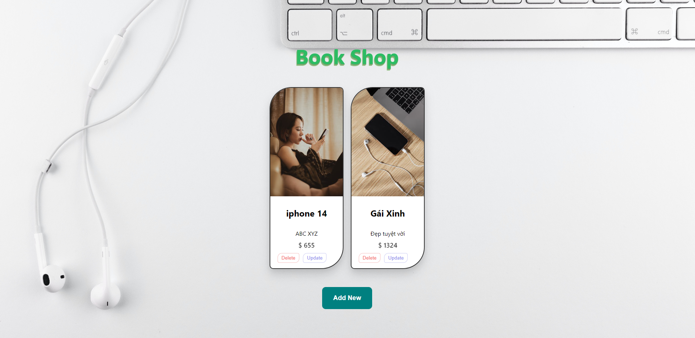
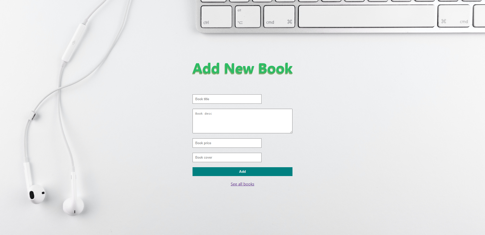

# CRUD_Books
# Backend Server:
```
npm i
```
```
npm start
```
# Client Server:
```
npm start
```
# Test API POSTMAN:
```
http://localhost:8800/books
```


<h2 style="color:red">Landing Books</h2>

<br/>
<h2 style="color:red">Landing Books</h2>


<br/>
<h4>Tech:</h4>
<br/>

<p>FE: REACTJS</p>
<br/>
<p>BE: NodeJS - ExpressJS</p>
<br/>
<p>DB: MySQL</p>
<br/>
<p>API: PostMan</p>


